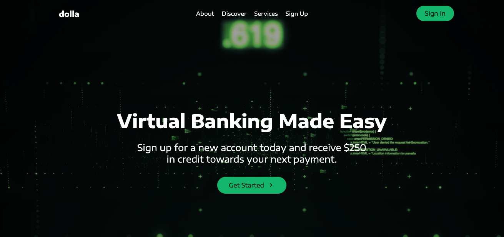

 <a href="https://reactjs.org/" target="_blank"> 
   
<h2><a href="https://a1danw.github.io/styled_components-react-virtual_banking-page/#/" target="_blank">Responsive single page using styled components in React.</a></h2>

